# Grabert Keyboard Hardware

💻 🖥️ ⌨️ Open-source ~60% Mechanical Keyboard 🎉

Build Guide and additional information [here](doc/BUILDGUIDE.md)!

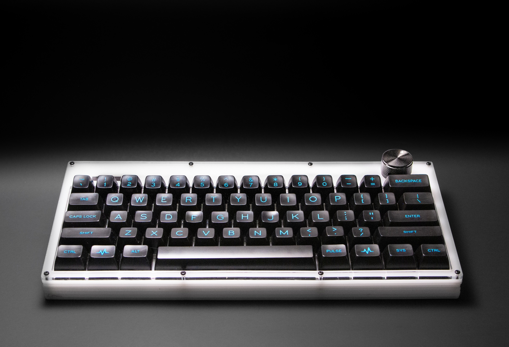
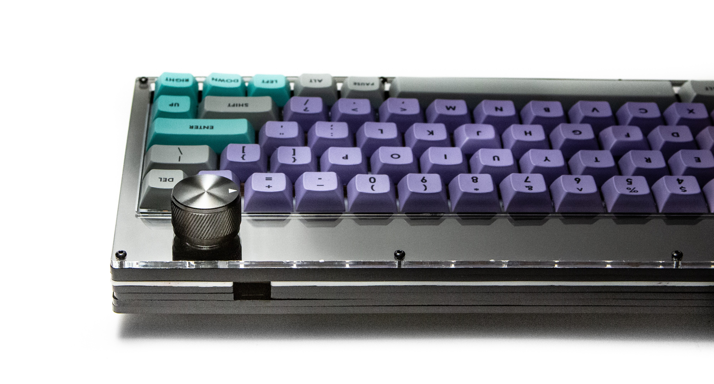
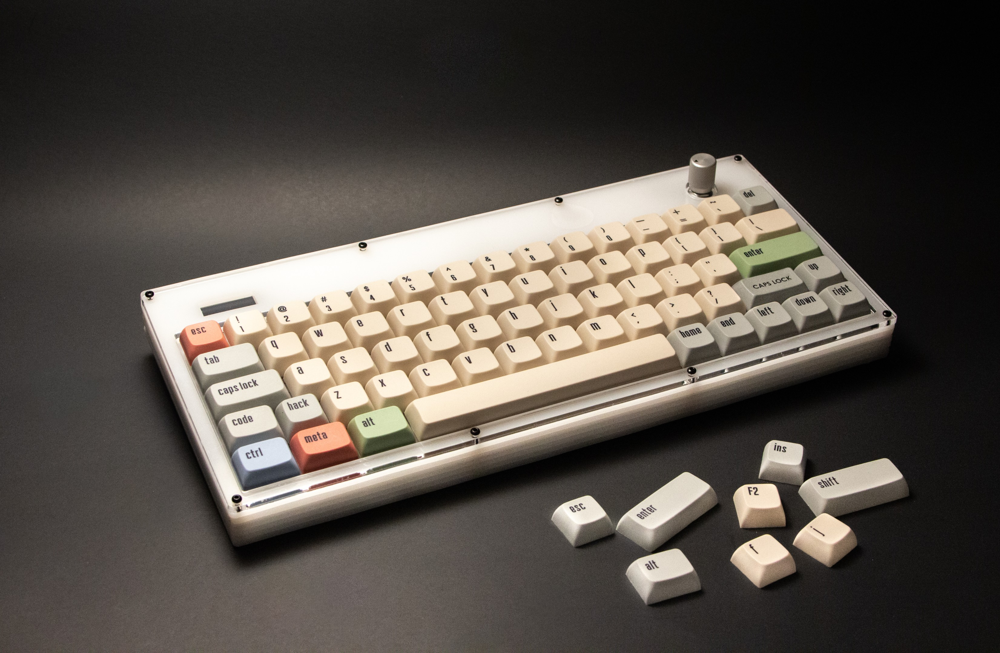

  
Screen and Foot

  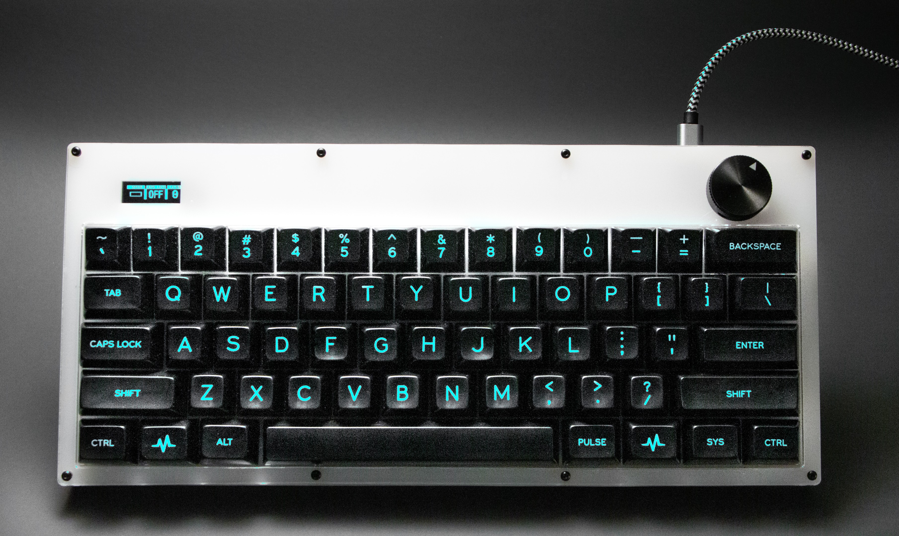
  

 

  
PCB Images

  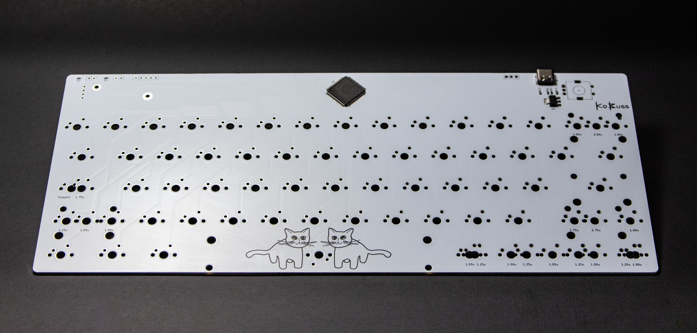
  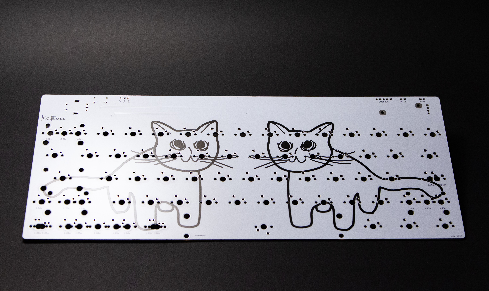

 

[PCB design video](https://youtu.be/ezk02GJ9iMs)

[Case design video](https://youtu.be/DsW-hKeB3mc)

## Features

- OLED Screen
- Rotary Knob
- Sandwich Mount Case
- POM Switch Plate
- [4 Layout Options](doc/BUILDGUIDE.md#preparation-and-layout-decision)
- 32-bit Microcontroller

### Powered by

- [QMK](https://github.com/qmk/qmk_firmware) ([KoBuss QMK Fork](https://github.com/KoBussLLC/qmk_firmware))
- [VIA](https://caniusevia.com/)

## PCB

This project uses KiCad 6 for electrical CAD

### Electrical Design Constraints
- No diode matrix enabled by LQFP 100 MCU Footprint
- 32-bit STM32 Microcontroller (STM32F072V8T6)
- USB-C
- PCB Mount Switches
- PCB Mount Stabilizers
- Push-Button Encoder
- 0.91" 128x32px I2C OLED Display (SSD1306)

### Changes
- V0 had incorrectly valued bypass capacitors. Testing showed no obvious issues, but it is not preferable.

## CAD

This project uses FreeCAD 0.19 for mechanical CAD

### Required Add-ons
- Assembly 4
- Fasteners
- kicadStepUpMod

### Mechanical Design Contraints
- ~60% Keyboard Layout
- 5 Layout Options
- Push Button Encoder
- OLED 128x32 Screen
- Fully Laser Cut Case
- POM Switch Plate
- 2mm diameter fasteners

### Acrylic Sheet Stackup

Main Case Stackup. "0" is the bottom of the case.

| Sheet Number | FreeCAD "Part" | Thickness | Material | Shape |
| - | - | - | - | - |
| 0 | bottom | 0.125 in | Acrylic | 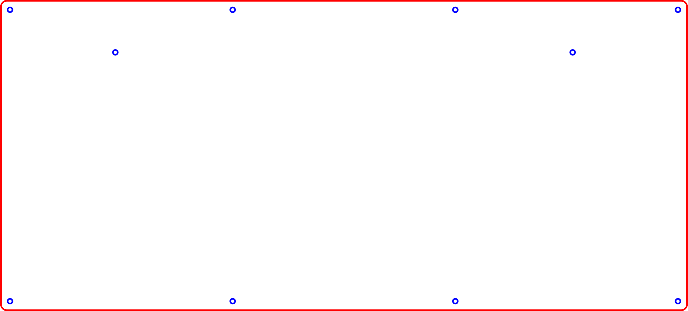 |
| 1 | closed_spacer | 0.125 in | Acrylic | 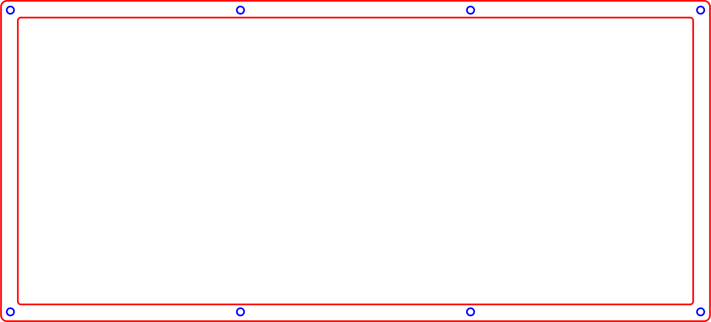 |
| 2 | usb_spacer | 0.125 in | Acrylic | 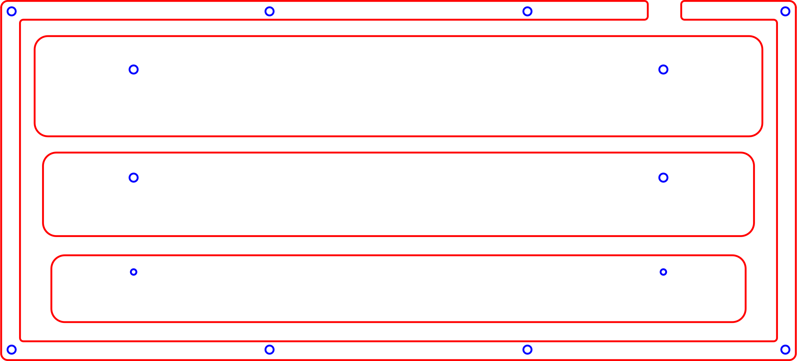 *with feet |
| 3 | usb_spacer | 0.125 in | Acrylic |  *with feet |
| 4 | switch_plate | 0.0625 in | POM/Acetal | 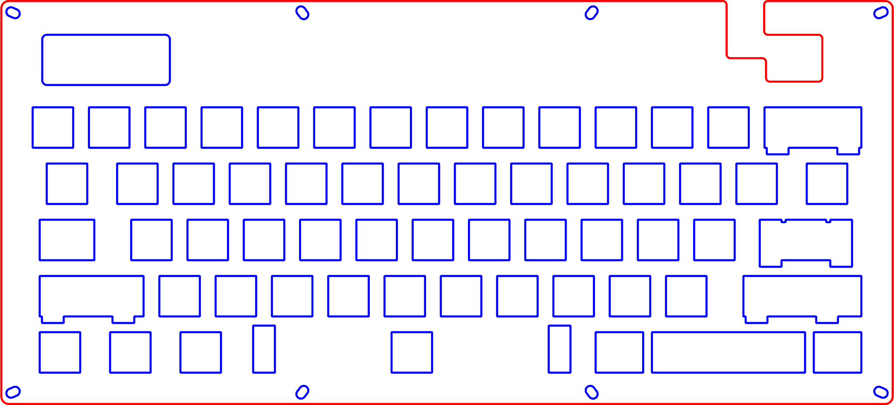 |
| 5 | closed_spacer | 0.125 in | Acrylic |  |
| 6 | colored_top | 0.125 in | Acrylic | 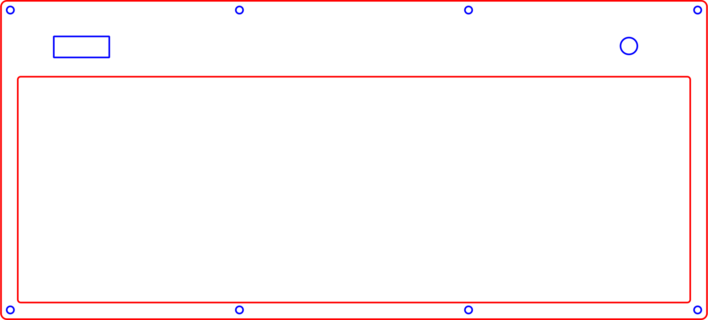 |
| 7 | clear_top | 0.125 in | Acrylic | 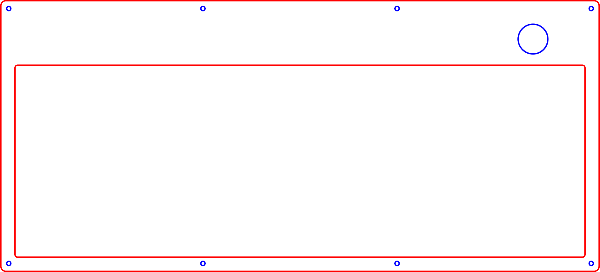 |

#### Angled Foot Stackup

Foot stackup. "0" is closest to the case and is on the "top"

| Sheet Number | FreeCAD "Part" | Thickness | Material |
| - | - | - | - |
| 0 | foot_0 | 0.125 in | Acrylic |
| 1 | foot_1 | 0.125 in | Acrylic |
| 2 | foot_2 | 0.125 in | Acrylic |

## License
MIT License

Copyright (c) 2021 KoBuss LLC

Permission is hereby granted, free of charge, to any person obtaining a copy of this hardware, software, and associated documentation files (the "Product"), to deal in the Product without restriction, including without limitation the rights to use, copy, modify, merge, publish, distribute, sublicense, and/or sell copies of the Product, and to permit persons to whom the Product is furnished to do so, subject to the following conditions:

The above copyright notice and this permission notice shall be included in all copies or substantial portions of the Product.

THE PRODUCT IS PROVIDED "AS IS", WITHOUT WARRANTY OF ANY KIND, EXPRESS OR IMPLIED, INCLUDING BUT NOT LIMITED TO THE WARRANTIES OF MERCHANTABILITY, FITNESS FOR A PARTICULAR PURPOSE AND NONINFRINGEMENT. IN NO EVENT SHALL THE AUTHORS OR COPYRIGHT HOLDERS BE LIABLE FOR ANY CLAIM, DAMAGES OR OTHER LIABILITY, WHETHER IN AN ACTION OF CONTRACT, TORT OR OTHERWISE, ARISING FROM, OUT OF OR IN CONNECTION WITH THE PRODUCT OR THE USE OR OTHER DEALINGS IN THE PRODUCT.

### For the Keyboard Community
You can produce and sell this keyboard. KoBuss LLC is not liable. Creator attribution is preferred but not required.

### License Change?
We initially licensed this under the Creative Commons Attribution-NonCommercial 4.0 International License, but have since decided to change it to MIT.
This would not be appropriate if the product was in production and had been forked/derived, but because we made the license change early on we deemed it acceptable.
If you have any issues with this change, please contact us directly.