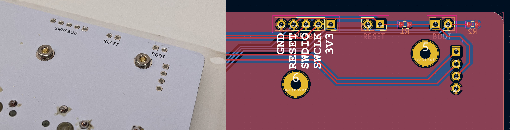
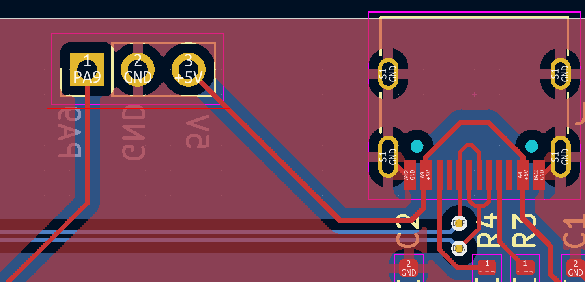

# Firmware Customization

## QMK Firmware

The keyboard firmware shipped with all Grabert keyboard is QMK with VIA enabled. To see the latest firmware, see the [KoBuss QMK Fork](https://github.com/KoBussLLC/qmk_firmware). It is reccomended to use VIA for keyboard configuration before diving into firmware customization, but it is only natural to see what mischief you can accomplish with your own 1's and 0's 💾.

The current firmware uses the OLED screen for WPM speed, caps lock indicator, and layer indicator. The images are hard coded using the `grabert.h` file and the [image2cpp](https://javl.github.io/image2cpp/) website is used to convert pixels into vertically packed bits. If you want to change what gets displayed, remove all the OLED logic and implement your own, or simply use image2cpp in the vertical mode to create the arrays your code needs 🎨.

By default the bottom-right modifiers and right shift are toggle-tap keys that are arrow keys on "tap" and modifiers on "hold", but you can use other advanced features by changing the keymap and possibly the config and make file.

### DFU and Reset

The STM32F072 series has an internal USB bootloader that is booted into from a software reset or by a hardware reset. It is much easier to use the software reset. To use the software reset, get into layer 2 with right and left modifiers and press the rotary encoder. If you change the keymap so that you can not trigger a software reset, you must take the case apart and trigger the reset in hardware. The boot pin must be pulled high while the MCU is reset. To do this on the Grabert PCB, simply use a wire and connect the boot jumper and while the boot jumper is connected, connect the reset jumper and the release the jumper. See the image in the *Debugger Programming* section for reference.

You should see a STMicroelectronics device show up your device tree, which means that your PCB is ready to be programmed.  `STMicroelectronics STM Device in DFU Mode`

To program your new firmware, flash a compiled bin with `dfu-util`. The STM32F072V8 only containes 64 Kbytes of flash, so make sure to not go crazy with too many stored images for the OLED. To learn more about building the firmware see the QMK docs.

Build Command
``` sh
make kobuss/grabert:via
```

Build and Flash Command
``` sh
make kobuss/grabert:via:dfu-util
```
### Debugger Programming

**This is not normally needed unless you need breakpoints or register level access**

To fully debug your firmware, you will need a JTAG or ST-Link programming device. Connect it to the SWD pins on the PCB and start a debug sesion!

To access the SWD pins, you must take the case apart:


### Extending Functionality

#### LED Underlighting
Pin A9 of the STM32072 is broken out on the left of the USB, along with the USB 5V rail and ground. Pin A9 is a TIM1_CH2 enabled pin and therefore could be used for dimmable single color underglow or bit banged for an RGB string. This is not officially supported but may be documented further in the future.

This pin could also be used as an input in a case where you want a giant mechanical switch for some special function.



### Wanted QMK additions to Grabert
If you are working on the firmware for Grabert and want to see what you might be able to add, the following is a list of things that we believe others could benefit from.

- Implement STM32 RTC to enable programable clock to display on the OLED
- Add configurable WS2812 or PWM based LED on PA9
- Crazy cool OLED implementations!
- Add custom VIA "eeprom" storage for encoder along with custom VIA implementation of the encoder

## Rust Firmware

TODO: Fork an existing Rust keyboard firmware and write a Grabert implementation
